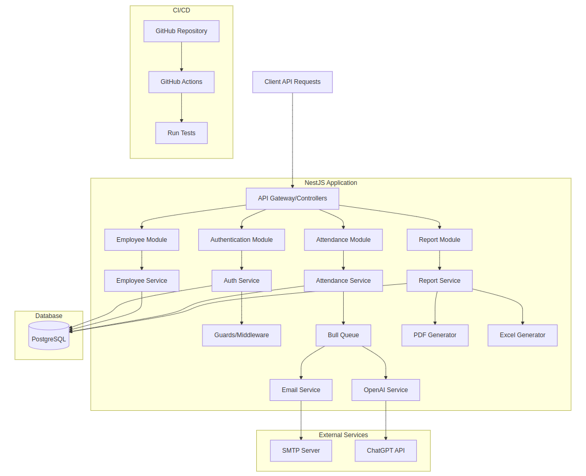

## Employee Management API 
[](https://github.com/AbdulKhaliq59/Employee-management/actions/workflows/test-on-pr.yml)


A streamlined API for efficient employee management, attendance tracking, and reporting.

---

# Description

This project is an API built with NestJS that serves as a functional employee management tool, showcasing best practices in TypeScript, testing, and code structuring. It includes features such as a full authentication system, employee CRUD, attendance tracking, automated email notifications, and reporting tools. This API is intended to demonstrate technical skills in backend development, employing design patterns and code structure principles, and incorporating testing and deployment practices.

## Documentation

### Core Endpoints

- **Authentication**
  - `POST /auth/register` - Register a new employee
  - `POST /auth/login` - Log in an employee
  - `POST /auth/reset-password` - Reset password
- **Employee Management**
  - `GET /employees` - Retrieve list of employees
  - `POST /employees` - Create a new employee record
  - `PUT /employees/:id` - Update employee information
  - `DELETE /employees/:id` - Delete an employee record
- **Attendance**
  - `POST /attendance/checkin` - Register employee check-in
  - `POST /attendance/checkout` - Register employee check-out
  - `GET /attendance/report/pdf` - Download PDF report of attendance
  - `GET /attendance/report/excel` - Download Excel report of attendance

## Setup

Below are step-by-step instructions for setting up the project in a local environment.

### Dependencies

Ensure you have the following dependencies installed:

- [Node.js](https://nodejs.org/) (version 20 or higher)
- [pnpm](https://pnpm.io/) (version 9 or higher)
- [PostgreSQL](https://www.postgresql.org/) (for database setup)

### Getting Started

1. **Clone the repository**:
   ```bash
   git clone https://github.com/your-username/employee-management-api.git
   cd employee-management-api
   ```

2. **Install dependencies**:
   ```bash
   pnpm install
   ```

3. **Environment Variables**:
   Copy `.env.example` to `.env` and configure the following environment variables:
   ```env
      `# General Configuration
      APP_PORT=

      # PostgreSQL Database Configuration
      DB_HOST=
      DB_PORT=
      DB_USERNAME=
      DB_PASSWORD=
      DB_DATABASE=

      # JWT Secret for authentication
      JWT_SECRET=

      # Email configuration (for nodemailer)
      EMAIL_HOST=
      EMAIL_PORT=
      EMAIL_USER=
      EMAIL_PASSWORD=

      # OpenAI API Key
      OPENAI_API_KEY=`
   ```

### Run The Service

1. **Start the API in Development Mode**:
   ```bash
   pnpm start:dev
   ```

2. **Access the API**:
   The API will be available at `http://localhost:{APP_PORT}`.


## Microservices Architecture

This project is designed with a microservices architecture within the NestJS framework, enabling modular, scalable, and maintainable code. The system is divided into distinct services, each responsible for specific tasks, and it leverages asynchronous processing where necessary.

### Architecture Diagram

  
*The architecture diagram illustrates the structure of microservices within the NestJS application, external integrations, and CI/CD workflows.*

### Microservices Overview

1. **Employee Service**  
   - Manages all employee-related CRUD operations (Create, Read, Update, Delete).
   - Stores employee information in a PostgreSQL database.
   - Acts as the primary service for handling employee data within the system.

2. **Authentication Service**  
   - Provides user authentication and authorization using `PassportJS`.
   - Ensures secure access across all endpoints with guards and middleware.
   - Manages login, registration, password reset, and logout functionality.

3. **Attendance Service**  
   - Handles recording employee attendance, including check-in and check-out times.
   - Integrates with the **Email Service** to trigger notifications upon attendance check-in.
   - Stores attendance records, which can later be accessed for reporting.

4. **Report Service**  
   - Generates attendance reports in PDF and Excel formats using `jsPDF` and `excelJS`.
   - Allows exporting daily attendance data into professional, standardized report formats for organizational use.
   - Works asynchronously to process reports on-demand and deliver them as needed.

5. **Email Service**  
   - Responsible for sending email notifications to employees upon check-in.
   - Uses Bull Queue to manage email jobs, ensuring efficient handling and queuing of emails.
   - Connects with an external SMTP server to send attendance-related emails to employees.

6. **OpenAI Service**  
   - Utilizes the ChatGPT API to generate personalized content for emails sent to employees during check-ins.
   - Enhances email content with dynamic, human-like responses, adding a customized touch to notifications.

### Additional Components

- **Bull Queue**  
   - Manages asynchronous jobs like email notifications, decoupling email sending from main application processes.
   - Improves scalability by handling tasks such as email generation and delivery in the background.

- **External Services**:
   - **SMTP Server** - An external mail server connected with the Email Service to send notifications.
   - **ChatGPT API** - Integrated with the OpenAI Service to generate custom email content upon attendance check-ins.

### CI/CD Workflow

- **GitHub Actions**  
   - Configured to run automated tests on every pull request.
   - Ensures all services and components work as expected before merging new changes, maintaining code quality and reliability.

### Database

- **PostgreSQL**  
   - Stores essential data for employees, attendance logs, and report metadata.
   - Provides a stable and reliable database solution for data persistence across services.


## Testing

To ensure the code is functioning correctly, the following tests can be run:

1. **Run All Tests**:
   ```bash
   pnpm test
   ```

2. **Run Tests in Watch Mode**:
   ```bash
   pnpm test:watch
   ```

3. **Generate Test Coverage Report**:
   ```bash
   pnpm test:cov
   ```

## Contribute

To contribute, please follow these steps:

1. **Fork the repository** and create your feature branch:
   ```bash
   git checkout -b feature/YourFeature
   ```

2. **Make your changes** and **commit**:
   ```bash
   git commit -m "Add your message here"
   ```

3. **Push to the branch** and open a pull request:
   ```bash
   git push origin feature/YourFeature
   ```

## Deployment

For deploying the project:

1. Ensure all tests pass by running:
   ```bash
   pnpm test
   ```

2. **Build the Project**:
   ```bash
   pnpm build
   ```

3. **Push the Code** to the production branch or follow your CI/CD process:
   ```bash
   git push origin main
   ```
